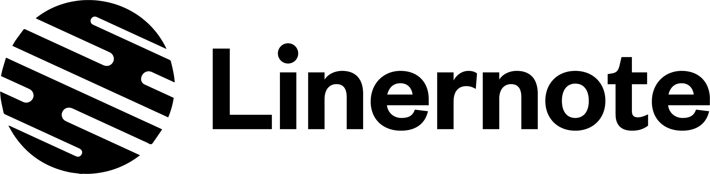

<p align="center">

</p>

<h1 align="center">Meesterproef 2019 @cmda-minor-web · 2018-2019</h1>

<p align="center"><b>Linernote brings Spotify, Youtube, articles and Social Media content from artists together in one app, supplemented by concert tickets.</b>
</p>

<br>

<p align="center">
  <a href="https://browser-technologies-1819.herokuapp.com/">
    
  </a>
  &nbsp;&nbsp;&nbsp;
  <a href="https://creativecommons.org/licenses/by-nc-nd/3.0/">
    
  </a>
</p> 

<br>


<br>

## Introduction
Linernote is made as part of a course from [@cmda-minor-web 18-19](https://github.com/cmda-minor-web/meesterproef-1819). In this course I had to choose one of 16 assignments; Linernote was chosen.

Linernote is a thought-out idea by [Joost de Boo](http://www.joostdeboo.nl). His idea of Linernote is to have one central place where you (the user) can find everything about the artists you love, in one place. You can read about his vision of Linernote on his own website: [Joost de Boo: Linernote](http://www.joostdeboo.nl/linernote), though his actual concept has changed since then.

## Table of Contents

- [Installation](#installation)
- [Design rationale](#design-rationale)
  - [Debriefing](#debriefing)
  - [Problem definition](#problem-definition)
  - [Solution](#solution)
    - [Database](#database)
    - [Authentication and Spotify](#authentication-and-spotify)
    - [Artist description](#artist-description)
    - [Social Links](#social-links)
    - [Social Media](#social-media)
    - [Articles](#articles)
    - [Tickets](#tickets)
  - [Code](#code)
- [Product biography](#product-biography)
  - [Kick-off](#kick-off)
  - [First week](#first-week)
  - [Second week](#second-week)
  - [Third week](#third-week)
  - [Fourth week](#fourth-week)
  - [Fifth week](#fifth-week)
- [Happy customer](#happy-customer)
- [Wishlist](#wishlist)
- [Sources](#sources)
- [License](#license)

## Installation
In order to use this application you will have to register your own named application on Spotify, Twitter, YouTube, The New York Times, Ticketmaster and Google News and set the necessary credentials in a .env file. 

Please read the [Attribution-NonCommercial-NoDerivs 3.0 Unported License (“BY-NC-ND 3.0”)](https://creativecommons.org/licenses/by-nc-nd/3.0/) before you download and use this application and/or material.

<details>
  <summary>Show me the installation steps!</summary>

1. Create an application on the [Spotify's Developer Site](https://developer.spotify.com/my-applications/).

2. Add redirect_uri in the Spotify Developer panel
```bash
http://localhost:3000/spotify/callback
```

3. Create a .env file. You can find the id and secret in the Spotify Developers panel.
```bash
REDIRECT_URI=http://localhost:3000/spotify/callback
SPOTIFY_CLIENT_ID={{client_id}}
SPOTIFY_CLIENT_SECRET={{client_secret}}
```

4. Create an application on the [Twitter Developer Site](https://developer.twitter.com/) and add the key, secret and bearer token to the .env file.
```bash
TWITTER_CONSUMER_KEY={{consumer_key}}
TWITTER_CONSUMER_SECRET={{consumer_secret}}
TWITTER_BEARER_TOKEN={{bearer_token}}
```

5. Retrieve API Keys for YouTube, The New York Times, Ticketmaster and Google News, and place them in the .env file.
```bash
YOUTUBE_API_KEY={{api_key}}
NEWYORKTIMES_API_KEY={{api_key}}
TICKETMASTER_API_KEY={{api_key}}
GOOGLENEWS_API_KEY={{api_key}}
```

6. Set a session secret in the .env file.
```bash
SESSION_SECRET={{PlaceLiterallyAnythingHere}}
```

7. Open your terminal

8. Change the directory to a folder in which you want to place the files
```bash
cd /~path
```
9. Clone the repository (you're going to need [Git](https://www.linode.com/docs/development/version-control/how-to-install-git-on-linux-mac-and-windows/))
```bash
git clone https://github.com/Mennauu/meesterproef-1819
```
10. Change directory to repository
```bash
cd meesterproef-1819
```
11. Install dependencies from [package.json](https://github.com/Mennauu/browser-technologies-1819/blob/master/package.json)
```bash
npm install
```

12. Place the .env file in the root folder

13. Run application with [Node](https://nodejs.org/en/)
```bash
node app.js
```

</details>

## Design rationale

### Debriefing
As mentioned in the introduction, Linernote is a thought-out idea by [Joost de Boo](http://www.joostdeboo.nl). His idea of Linernote is to have one central place where you (the user) can find everything about the artists you love, in one place. 

Linernote wants to show Spotify and Social Media content together with articles and tickets for events and concerts, based on the artists you love.

You can read about Joost his original vision of Linernote on his own website: [Joost de Boo: Linernote](http://www.joostdeboo.nl/linernote), though his actual concept has changed a bit since then.

I will be working on creating a web app version of Linernote. Joost will be working on the design.

### Problem definition
When you like an artist, you spend time on multiple platforms to search and gather information about the artist. Why waste time on checking different apps and websites if you could check all the content at once?

In order to show all the content from other platforms we need to have access to that content.

### Solution

8 API's are being used to retrieve content
- Spotify Web API
- Twitter API
- MusicBrainz API
- YouTube Google API
- Ticketmaster API
- MediaWiki API
- The New York Times API
- Google News API

Instagram data isn't retrieved using their official API, because you can't recieve public content from their API.

#### Database
In order to save account details and be able to follow artists, we need a **database**. The project is made using JavaScript, NodeJS and Express; [mongoDB](https://www.mongodb.com/) is a perfect database when using these tools, because MongoDB is a document database, which means it stores data in JSON-like documents. [Mongoose](https://mongoosejs.com/) is used as a boilerplate. 

#### Authentication and Spotify
In order to authenticate the user (with [OAuth 2.0](https://oauth.net/2/)) and save its account ID in the database, we use the [Spotify Web API](https://developer.spotify.com/documentation/web-api/), following the [Spotify Authorization Guide](https://developer.spotify.com/documentation/general/guides/authorization-guide/). We use spotify for the authentication process, because you need to be authenticated as a user in order to retrieve certain data from Spotify or make certain actions:

- To be able to search for artists and retrieve results
- To retrieve top tracks of concerning artist
- To retrieve related artists
- To retrieve artist images
- To retrieve information of the authenticated user
- To rertrieve information on the current song playing (in spotify from authenticated user)
- To be able to pause and play songs

The [Spotify Web API JS](https://www.npmjs.com/package/spotify-web-api-js) library is used as a wrapper for the Spotify Web API.

#### Artist description
The [Wikipedia API](https://www.mediawiki.org/wiki/API:Main_page) is used to retrieve a description of the given artist

#### Social Links
In order to get all the necessary social links of an artists we use the [Musicbrainz API](https://wiki.musicbrainz.org/Development/JSON_Web_Service). For example, when searching for Beyonce the API returns the URL: https://www.instagram.com/beyonce/ as the instagram social link.

#### Social Media
Since we have the social links, we now need to retrieve the most recent posts or upload from each platform; Instagram, Twitter and YouTube.

> **Instagram**<br>
Instagram doesn't have an API where you can retrieve public data from a given user. However, if you add <i>?__a=1</i> after the Instagram Social Link, it returns all the data of that given user. We fetch the data from that link and search for the URL shortcode from the latest post, which is used to embedd the post within Linernote.

> **Twitter**<br>
To retrieve the latest Twitter post of a given user you have to create a [developer account at Twitter](https://developer.twitter.com/) and get verified for your project. As soon as you are verified (and retrieved a key, secret and token) you can use the Twitter API to retrieve the URL shortcode from the latest feed post of a given user, which is used to embedd the post within Linernote.

The [Twitter for Node.js](https://www.npmjs.com/package/twitter) library is used as a wrapper for the Twitter API.

> **YouTube**<br>
To retrieve the latest YouTube upload of a given user you have to sign up at Google and retrieve an API key. You can then use the [YouTube Google API v3](https://developers.google.com/youtube/) to search for a playlist with all uploaded videos - you have to filter out the latest one.

#### Articles
We get articles from two sources: The New York Times and Google News.

> **The New York Times**<br>
In order to use the [API from The New York Times](https://developer.nytimes.com/apis) you need to create a project on their [developer website](https://developer.nytimes.com/). After creation you will retrieve an API key with which you can search for articles from The New York Times based on the name of the artist.

> **Google News**<br>
Google News gets their articles from 30.000 sources all over the internet. In order to use the [Google News API](https://newsapi.org/s/google-news-api) you have to create a new account and request an API key. With the API key you can search in their database for the most recent articles based on the name of the artist.

#### Tickets
To show events and concerts from artists, we use the [Ticketmaster API](https://developer.ticketmaster.com/). You have to create an account to get an API key in order to use their API. The results are based on the name of an artist. For monetization you need a business verified API key.

### Code
Linernote is created using HTML, SCSS, JavaScript, Handlebars, NodeJS, Express, MongoDB and SocketIO.

The code consists of 600+ lines of HTML(and handlebars), 800+ lines of JavaScript and 1000+ lines of SCSS.

<details>
  <summary>Show me some code!</summary>

<br>

**SCSS**<br>
SCSS is used to write beautiful component based CSS. Let's take the Spotify Player as an example. 

```SCSS
.spotify {
  position: fixed;
  bottom: 50px;
  height: 50px;
  background-color: $black-light;
  z-index: 10;
  width: 100%;
  border-bottom: 1px solid $gray-dark;
  color: $white;
  display: flex;
  align-items: center;
  padding: 0 1em;

  &__progress {
    width: 1px;
    height: 3px;
    background: $white;
    transition: width .1s linear;
    visibility: hidden;
  }

  &__image {
    width: 30px;
    height: 30px;
    margin-right: 1em;
  }

  &__song {
    text-align: center;
    width: 100%;
    display: flex;
    justify-content: center;
    flex-direction: column;
    overflow: hidden;
  }

  &__artist {
    display: inline-block;
    text-transform: lowercase;

    &::first-letter {
      text-transform: uppercase;
    }
  }

  &__track {
    color: $gray;
    text-transform: lowercase;
    text-overflow: ellipsis;
    overflow: hidden;
    white-space: nowrap;

    &::first-letter {
      text-transform: uppercase;
    }
  }

  &__remote {
    height: 30px;
    min-width: 30px;
    border: 1px solid $white;
    border-radius: $rounded;
    margin-left: 1em;
    display: flex;
    align-items: center;
    justify-content: center;
    transition: 0.2s;
    cursor: pointer;
    -webkit-font-smoothing: antialiased;
    text-rendering: optimizeLegibility;
    -moz-osx-font-smoothing: grayscale;
  }

  &__id {
    display: none;
  }

  &__refresh {
    display: flex;
    width: calc(100% - 3em);
    align-items: center;
  }
}
```
**Handlebars**<br>
Handlebars are used to build semantic templates. I can use a layout for multiple views; two layouts are created while there are 4 views. Lets take the Authentication Layout as an example with the Login view.

_**Authentication Layout**_
```handlebars
<!DOCTYPE html>
<html lang="en">

  <head>
    <meta charset="utf-8">
    <meta content="width=device-width, initial-scale=1, viewport-fit=cover" name="viewport">
    <title>Linernote</title>
    <meta name="description"
      content="Linernote brings Spotify, Youtube, articles and Social Media content from artists together in one app, supplemented by concert tickets.">
    <link rel="icon" type="image/png" href="/images/favicon.png">
    <link rel="stylesheet" href="/css/styles.css">
    <link rel="stylesheet" href="https://fonts.googleapis.com/css?family=Nunito+Sans:300,400,700,900">
  </head>

  <body class="{{template}}">
    {{{body}}}
  </body>

</html>
```

_**Login view**_
```handlebars
<div class="authentication">
  
  <p class="authentication__description">Linernote brings Spotify, 
    Youtube, articles and Social Media content from artists together 
    in one app, supplemented by concert tickets.</p>
  <a href="/spotify/login" class="button button--spotify">Login with spotify</a>
  <small class="authentication__note">Note: you need a <a
      href="https://www.spotify.com/nl/premium/?checkout=false">premium
      account</a></small>
</div>
```

**MongoDB**<br>
MongoDB is used to setup the database (based on Mongoose). The only things necessary are connecting to the database, and being able to add a user to it with a record (array in this case) in which the id's of the (followed) artists can be placed.


```JavaScript
class Database {
  constructor() {
    this._connect()
  }

  _connect() {
    mongoose.connect(uristring, { useNewUrlParser: true })
      .then(() => {
        console.log('Database connection successful: ' + uristring)
      })
      .catch(err => {
        console.error('Database connection error: ' + uristring)
      })
  }
}
```

```JavaScript
const userSchema = new mongoose.Schema({
  user: String,
  following: []
})
```

**SocketIO**<br>
SocketIO is used to be able to load the page without having to wait for all the API calls to return with data. The page can be openend nearly instant, with a loading state for the data. Sockets are also used to poll the Spotify API every couple of seconds to retrieve the current playing song from the authenticated user. The front-end will update as soon as a **new** song gets polled.

```JavaScript
io.on("connect", socket => {
  getPlayBackState(socket)

  socket.on('artist-name', async (name) => {
    socket.emit('artist-data', await getArtistData(name))
  })
  socket.on('following-list', async (data) => {
    socket.emit('artist-data', await getMultipleArtistData(data.followList, data.token))
  })
})
```

</details>

## Product biography

### Kick-off
On the 20th of May we had the kick-off at the Volkshotel @ 10 am. During the kick-off Joost gave a [short presentation about Linernote](https://onedrive.live.com/?authkey=%21ADrc8kzEevMWYAI&cid=F3D45B310A388925&id=F3D45B310A388925%2121950&parId=F3D45B310A388925%2121704&o=OneUp), and in that presentation he mentioned that the 4 most important platforms that have to be included in the application are: Instagram, YouTube, Spotify and Ticketmaster. I also learned that Joost is a graphic designer, cool.

Based on the kick-off I decided to work on creating Linernote alone, without a team. The reason behind this is that I wanted to challenge myself and make my own time schedule. I estimated that I could do it on my own, and I would learn a lot from it since I had never worked with databases or loads of API's before.

Even though the kick-off was on the 20th of May, the beginning of the assignment was on the 27th of May.

### First week

_May 27, 2019_

Joost send a file of a design he had already created for Linernote. I looked at the design and decided to start with a research to see if the design is viable. I did research on the 4 most important platforms about retrieving data (from each of them). You can find the research here (sorry, it's in dutch): [Modulemogelijkheden Linernote](PROJECT-assets/readme/modulemogelijkheden.pdf). I'll include a translated summary of the research underneath.

| Platform | Conclusion |
|------------|--------------|
| Instagram | The data cannot be retrieved with their Instagram API, but through embedding it should be possible to load (embedded) messages from an artist. The design therefore looks different than the original design. |
| Youtube | The video and data can be retrieved through the IFrame Player API. The design differs slightly from the initial design, because the video in the initial design is not based on the YouTube video aspect ratio of 16 : 9. |
| Spotify | The needs of Linernote can be realized based on the Spotify Web API and Web Playback SDK to become. The Web Playback SDK cannot be used in commercial projects without prior written permission from Spotify. |
| Ticketmaster | The needs of Linernote can be based on the Ticketmaster Discovery API (without business verification) or Discovery Feed API (with business verification).

<i>Weeks later I figured out that some of the conclusions in the research weren't exactly correct. But we will get to that later!</i>

I came to the conclusion that the design isn't viable in its current state. For instance, you're not allowed to show public content from Instagram users on your website. Heck, you can't even receive public Instagram content from their API.

I shared the research in our #linernote slack channel, but Joost was on a holiday, so he wouldn't see it until our next meeting. Because of that I decided to set-up a coding environemt, based on Node, Express, SCSS and handlebars. I wrote the code for the base design of the app, setup the pages and routes and installed the packages that I wanted to use. 

Because the design wasn't viable I included a viable option in the application to show Joost, which was embedding the posts/uploads of users (static, currently). You can find a comparison underneath.


### Second week

_June 3, 2019_

We decided to meet every monday at the volkshotel @ 10 am. During the meeting I showed Joost my progress and the application in its current state. I told him about the design changes I had made based on the technical possibilities. He was pleased with the result. 

Because posts that are embedded are not cusomizable, Joost asked if it was posible to place content over other content, so that it was still possible to apply the initial design in the product. I told him it's possible, but that it's not realistic. He was going to look into it. 

I wrote a summary of the meeting which you can find here (sorry, it's in dutch): [Samenvatting-03-06-2019](PROJECT-assets/readme/samenvatting-03-06-2019.pdf). In the file you can see a comparison from the initial design, embedded design and embedded design with overlapping content.

Later that day Joost asked if I could include embeds of Twitter, YouTube, Facebook and SoundCloud, so that he could compare them. He also asked if it was possible to overlap content over the embedded posts (which are iframes). I did both, which you can see in the videos underneath. I also wrote a scrollable section for the followed artists.

<p align="center">
  

  
</p>

I told Joost before that the overlapping of content wasn't realistic. Basically, if a platform adjusts their embed styling, your element positions will be on the wrong place. Overnight it actually happened, for Twitter! They changed their embed styling. We concluded that overlapping content over iframes wasn't the way to go and that there would be no Linernote comment section (per post).

A couple of days later Joost asked for screenshots of the embedded designs for Instagram, Twitter, Facebook and Spotify, so he could make a new Linernote design. So I did just that.


Meanwhile, I was implementing the authentication process with a Spotify Account. When I was done with that, I looked into the Web Playback SDK from Spotify, to play music from Spotify within Linernote. In my research I concluded that it would work, and it did, just not on mobile 😥.


On Thursday we had an extra meeting with Albert Meronyo, and Joost. Albert gave us a presentation about Linked Data; RDF, SparQ and API's. He had been working with students from the University of Amsterdam to set-up a small database for Linernote with a couple of artists and a lot of their information (like name, date of birth, social links and more). He explained how it all worked. 

<i>Later on we found out that the database they set-up wasn't necessary, because the MusicBrainz API had all the same data, but for way more artists!</i>

I also found out that if you paste <i>?__a=1</i> behind the Instagram social link of a given person, you will get all their data in JSON format. That would be our way to get the shortcode of the latest post of that given user.

On Friday Joost came with a new design, which included only the embedded posts, without any overlapping content. The design also included how articles would be shown. You can check out the design here: [Linernote embedded design](PROJECT-assets/readme/linernote_embed_design.pdf)

### Third week

_June 10, 2019_

We didn't meet this week, because it was Pentecost on monday. It was fine, because I had a lot of coding work to do. I decided to focus on the search and artist page.

I implemented the ability to search for artists; everytime you add a letter a new request is made to Spotify to retrieve new artists based on the search query. I made the artist page fully responsive: the font size of an artist's name automatically scales based on the length of the name. With every artist all information is in the same position. I also added a carousel on the artist page: in the first section you can see the artist name, image and a follow button, in the second 'slide' the top 5 tracks of the artist are shown and in the third 'slide' information about the artist in is taken from Wikipedia. The third slide is not available for artists when they have no wikipedia page. There is a list of related artists under the carousel, which is retrieved from the Spotify API. I also included the design of the feed (which is still static at this point).

<p align="center">
  
</p>

After those updates I decided to add a database, because we want users to be able to follow artists. I had never worked with a database before. I asked Arash for advice and he told me to look into MongoDB and Mongoose.

On friday Joost came with MusicBrainz and we figured out that they have an API which you can use to retrieve all the social links from a given artist. We decided to use Spotify in combination with MusicBrainz.

It was possible to search for an artists name on the MusicBrainz API. Since we got the artist name from (Spotify) I could retrieve all the social links from that given artist. After filtering the data it came out like shown in the image underneath when searching for "Eminem".

<p align="center">
  
</p>

After the above I decided to keep on working on the database and it was working (but still buggy when multiple users would use the application, later on I found out this was the case because I didn't implement adding artists to a user the right way). On authroization that user would be added to the database. When the "Follow" button was clicked, the id of the artists would be added to that user in the database. On the front-end the artists was added to the following list.

The design didn't include any interactions or zero states, so I asked Joost if he could design a interaction for clicking on the following button and a zero state for when you don't follow any artist.


<p align="center">
  
</p>

### Fourth week

_June 17, 2019_

I met again with Joost at the volkshotel and I showed him the progress. It was a small conversation, he was very pleased with the result. He said he made some small design changes in the design that I could implement.

One of the changes was quite difficult to implement: adding a purple border to artists that you follow, throughout the entire app. It wasn't difficult for the artists in the following section, but it was difficult for the artists that where shown as related on the artist page. That data is retrieved from Spotify, and not from the database. I managed to solve it. All related artists that you follow are shown at the beginning of the related artists.

<p align="center">
  
</p>

The next step was to obtain all the data that should fill the feed. This would actually be the hardest part, because I had to research all of the API's. I asked Joost which sources he would like to have added for articles and he came up with The New York Times, Genius, NPR and Guardian. Sadly enough, NPR doesn't give out their articles and the API's from Genius and Guardian were limited. The New York Times was our only option for now. Later we found out about Google News... Google News got the most recent articles data from over 30.000 sources (Thank you Google!). Ofcourse, we also have to obtain data from the social media platforms, youtube and ticketmaster.

I explained in the design rationale how I retrieved all the data from the sources that we eventually used.

After obtaining and filtering out all the data that is necessary, I could show it on the front-end (I used handlebars for that). This was such a great moment, because it was a lot of trial and error! Sadly, the video footage of this magical moment got corrupted.

The next step was to load the data from all the artists that a user follows on the homepage. I had to rewrite my entire code for this, but I was eager to make it work. When it was finally done, I spend an entire day on bugfixes. The problem now is that it takes a really long time before a page is loaded, which makes the app unusable, so I had to fix that. I implemented Sockets to load in the data after the page had been loaded. This means the page is opened nearly instant and a loader is shown at the position where the data will be shown as soon as the data is available. WAY BETTER!

<p align="center">
  
</p>

Now for the last part, which is the Spotify Music Player within Linernote. Since we can't actually play songs from within Linernote, we decided to implement a "remote". Within this remote you should be able to see what you are currently listening to, and be able to pause and play the song. I used sockets to poll the Spotify API every few seconds to check if a new song started playing, so the front-end could be updated with the new data - REAL TIME!

<p align="center">
  
</p>

### Fifth week

_June 24, 2019_

The weather was great, so we met at the volkshotel on the roof terrace and had a cup of coffee. I showed my application to Joost and Vasilis and they were thrilled! Happy customer confirmed 😄.

The rest of the week was used for bugfixes and writing the documentation. There are still a couple of things I would have liked to implement, I added them to the wishlist.

## Learning goals and reflection
| _Course_               | _Learning goal_ | _Reflection_ |
|:---------------------:|---------------|------------|
| **CSS to the rescue**  | _You understand the broader scope of CSS_ | During the CSS to the rescue assignment I had to use the [SMACSS methodologie](http://smacss.com/). I took it on me to use [BEM](http://getbem.com/introduction/) for this project. Even though not part of CSS to the rescue, I also used [SCSS](https://sass-lang.com/), and learned a lot from it. SCSS allows you to write beautiful component based CSS code.
| **Web App From Scratch** | _You can retrieve data, manipulate it and dynamically convert it to html elements using templating_ | All the data retrieved from the API's are "manipulated" and converted to HTML elements (using Handlebars for templating).
|                      | _You understand how you can work with an external API using asynchronous code_ | 8 API's are currently being used in Linernote to retrieve data, using asynchronous code. Though 12 API's have been used in total, 4 of them didn't meet the data requirement. I have never experimented with so many API's at once.
|                      | _You can add structure to your code by applying patterns_ | I feel like I did really good with the functional code pattern and folders/files structure. Everything feels in place and every file can communicate with eachother. 
| **Performance Matters**  | _You know the difference between client side and server side rendering and you can apply server side rendering_ | At first (nearly) the entire application was server side rendered, but with the use of Sockets I also implemented client side rendering.
|                      | _You understand how the critical render path works and how you can optimize it for a better runtime and / or perceived performance_ | Especially on the perceived performance part, I used sockets to render data from all API's; I was able to load the page without having to wait for all the API calls to return with data. The page can be openend nearly instant, with a loading state for the data.
| **Real Time Web**        | _Deal with real-time complexity_ + _Handle real-time data management_ | Sockets are used to poll the Spotify API every couple of seconds to retrieve the current playing song from the authenticated user. The front-end will automatically update as soon as a **new** song gets polled.
|                      | _Handle real-time client-server interaction_ | A great interaction I implemented is the ability to play and pause the Spotify Player from the authenticated user. 
|                      | _Handle multi-user support_ | The application could be used by over a thousand people at the same time. Every user has its own session and data is saved in a database.


The last 5 weeks have been an enormous learning curve. I've experienced the pain of API's, but also the beauty. Spotify is the greatest example. At the beginning I had a difficult time dealing with their API, but now, it just naturally makes sense; and you can do **A LOT**! Things that I thought I would never do. I don't think I've ever had more lightbulbs above my head when working on a coding project. It will probably be a while before I get into another project with the use of so many API's 😉.

## Happy customer

✅ Happy customer confirmed ✅

## Wishlist
- [ ] Add filtering
- [ ] Add two line support for artist name on artist page
- [ ] Add offline data support (localStorage or serviceWorker)
- [ ] Infinite scrolling (for more content)
- [ ] Ability to swipe any feed item to the left to show some keywords and sharing options for that particular feed item.
- [ ] If possible, when clicking on a song from the top tracks, play it on Spotify.

## Sources
Underneath you will find some sources that have been helpful with creating Linernote.

- 📖: Documentation or article
- 🛠: Tool or library

> * 🛠 [Twitter for Node.JS](https://www.npmjs.com/package/twitter)
> * 🛠 [Cookie parser](https://www.npmjs.com/package/cookie-parser)
> * 🛠 [Dotenv](https://www.npmjs.com/package/dotenv)
> * 🛠 [Esm](https://www.npmjs.com/package/esm)
> * 🛠 [Express](https://www.npmjs.com/package/express)
> * 🛠 [Express Handlebars](https://www.npmjs.com/package/express-hbs)
> * 🛠 [NodeJS Library for Facebook](https://www.npmjs.com/package/fb)
> * 🛠 [Genius API client](https://www.npmjs.com/package/genius-api)
> * 🛠 [HTTP](https://www.npmjs.com/package/http)
> * 🛠 [Mongoose](https://www.npmjs.com/package/mongoose)
> * 🛠 [MusicBrainz API-client](https://www.npmjs.com/package/musicbrainz-api)
> * 🛠 [Node fetch](https://www.npmjs.com/package/node-fetch)
> * 🛠 [Node's querystring module](https://www.npmjs.com/package/querystring)
> * 🛠 [Socket.io](https://www.npmjs.com/package/socket.io)
> * 🛠 [Spotify Web API Node](https://github.com/thelinmichael/spotify-web-api-node)
> * 🛠 [Heroku](https://www.heroku.com/)
> * 🛠 [Handlebars](https://handlebarsjs.com/builtin_helpers.html)
> * 🛠 [Sass](https://sass-lang.com/)
> * 🛠 [HTML5 symbols](https://dev.w3.org/html5/html-author/charref)

> * 📖 [Twitter Developer API](https://developer.twitter.com/)
> * 📖 [The New York Times Developer Network](https://developer.nytimes.com/)
> * 📖 [Spotify Web API](https://developer.spotify.com/documentation/web-api/)
> * 📖 [How to send two variables in one message using Socket.io](https://stackoverflow.com/a/20632638/1300427)
> * 📖 [Get value of a string after a slash in JavaScript](https://stackoverflow.com/a/8376542/1300427)
> * 📖 [YOU MIGHT NOT NEED JQUERY](http://youmightnotneedjquery.com/)
> * 📖 [Dynamically load JS inside JS](https://stackoverflow.com/a/14521482/1300427)
> * 📖 [Using Handlebars on the server and client](http://tilomitra.com/handlebars-on-the-server-and-client/)
> * 📖 [Document cookie](https://developer.mozilla.org/en-US/docs/Web/API/Document/cookie)
> * 📖 [MusicBrainz API](https://wiki.musicbrainz.org/Development/JSON_Web_Service)
> * 📖 [Google News API](https://newsapi.org/s/google-news-api)
> * 📖 [Ticketmaster API](https://developer.ticketmaster.com/products-and-docs/apis/getting-started/)
> * 📖 [Wikipedia API](https://www.mediawiki.org/wiki/API:Main_page/nl)
> * 📖 [YouTube API](https://developers.google.com/youtube/)
> * 📖 [Socket io docs](https://socket.io/docs/)

<!-- How about a license here? 📜 (or is it a licence?) 🤷 -->
## License 
<a href="https://creativecommons.org/licenses/by-nc-nd/3.0/" rel="nofollow">
  
</a>